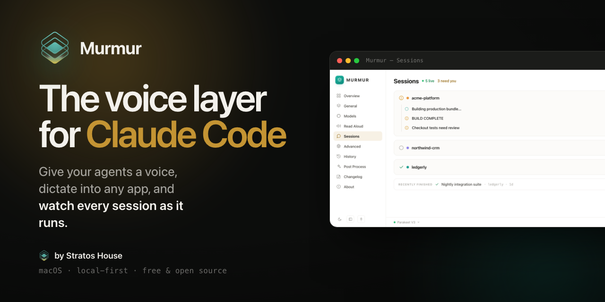

<p align="center">
  
</p>

<h1 align="center">Murmur</h1>

<p align="center"><strong>The voice layer for Claude Code.</strong></p>

<p align="center">Give your agents a voice, dictate into any app, and watch every Claude Code session as it runs. Local-first, private, and free.</p>

<p align="center">
  <a href="https://github.com/ArshiaEcho/murmur/releases/latest"><strong>Download for macOS</strong></a>
  &nbsp;·&nbsp;
  <a href="https://murmur.stratosagency.ai">Website</a>
  &nbsp;·&nbsp;
  a <a href="https://stratosagency.ai">Stratos House</a> product
</p>

<p align="center">
  
  
  
</p>

---

**Murmur** is a local-first macOS app that wraps a voice layer around your Claude Code workflow. Dictate into any text field, hear your agents' replies in natural neural voices, and keep a live eye on every Claude Code session on your machine. Everything runs on your own computer: no cloud, no telemetry, no account.

Murmur began as a fork of the open-source [Handy](https://github.com/cjpais/Handy) dictation engine, took visual cues from [VoiceBox](https://github.com/jamiepine/voicebox), and grew a whole new agent-voice layer on top. See [Credits](#credits) for the full lineage.

## Features

- **Dictate into anything.** Press a hotkey, speak, and your words land in the focused field — editor, terminal, browser, chat. Transcription runs on-device (Whisper or the CPU-optimized Parakeet V3); your audio never leaves the machine.
- **Read-Aloud neural voices.** Hear your agent think. Microsoft Edge neural voices (47 English, free, no API key) are the default, with fully offline Kokoro as a fallback and ElevenLabs behind an advanced option. Playback is sentence-chunked, so the first words speak in about a second.
- **Live Sessions observatory.** A per-project tree of every Claude Code session as it runs: what each agent is doing, in real time, with a chat drawer and push-to-talk so you can answer by voice.
- **One-click post-processing.** Refinement presets clean up a dictation, tighten it, or reshape it into an email or commit message. Runs on-device through Apple Intelligence by default.
- **Light and dark, refined.** A considered interface with a persisted theme toggle and a collapsible, lockable sidebar. Quiet in your menu bar, out of your way.
- **Built for Claude Code.** Designed around the way agents work — sessions, voice, and MCP-ready hooks that slot into your flow.

## How it works

1. **Press** your configurable shortcut to start or stop recording (push-to-talk also supported).
2. **Speak.** Silence is trimmed with on-device voice-activity detection.
3. **Release.** Murmur transcribes locally and pastes the text into whatever app is focused, optionally running a post-processing preset first.
4. **Listen.** Read-Aloud voices speak your agent's replies, and the Sessions observatory shows every run live.

## Install

**macOS (Apple Silicon).** Download the latest release from the [releases page](https://github.com/ArshiaEcho/murmur/releases/latest). The app is signed with a Developer ID and notarized by Apple, so it opens without warnings.

1. Open `Murmur_x.y.z_aarch64.dmg` and drag **Murmur** to your Applications folder.
2. Launch Murmur and grant **Microphone** and **Accessibility** permissions when prompted.
3. Set your dictation shortcut in Settings, and you are ready.

Updates are delivered in-app through the built-in updater.

## Development

Murmur is a [Tauri v2](https://v2.tauri.app/) app: a Rust core with a React + TypeScript frontend. For platform prerequisites and build steps, see [BUILD.md](BUILD.md).

```bash
bun install
bun tauri dev      # run the app in development
bun tauri build    # produce a release bundle
```

## Credits

Murmur stands on a lot of open source. We keep the credit it asks for and add our own work on top:

- **[Handy](https://github.com/cjpais/Handy)** by CJ Pais — the dictation engine Murmur is forked from. MIT licensed; Murmur retains that license and the original copyright, and extends the app with the voice, sessions, and post-processing layers above.
- **[VoiceBox](https://github.com/jamiepine/voicebox)** by Jamie Pine — the interface that inspired Murmur's visual language (clean surfaces, a single gold accent, class-based theming). Design inspiration only; no VoiceBox code is used.
- **[Whisper](https://github.com/openai/whisper)**, **[Parakeet](https://github.com/NVIDIA/NeMo)**, **[Kokoro](https://github.com/hexgrad/kokoro)**, **[edge-tts](https://github.com/rany2/edge-tts)**, **Silero VAD**, and the **Tauri** ecosystem power the engine room.

## License

Murmur is released under the **MIT License**. It retains the upstream Handy copyright (© 2025 CJ Pais) and adds Murmur's own (© 2026 Stratos House). See [LICENSE](LICENSE) for the full text.

<p align="center"><sub>Murmur is a product of <a href="https://stratosagency.ai">Stratos House</a>.</sub></p>
